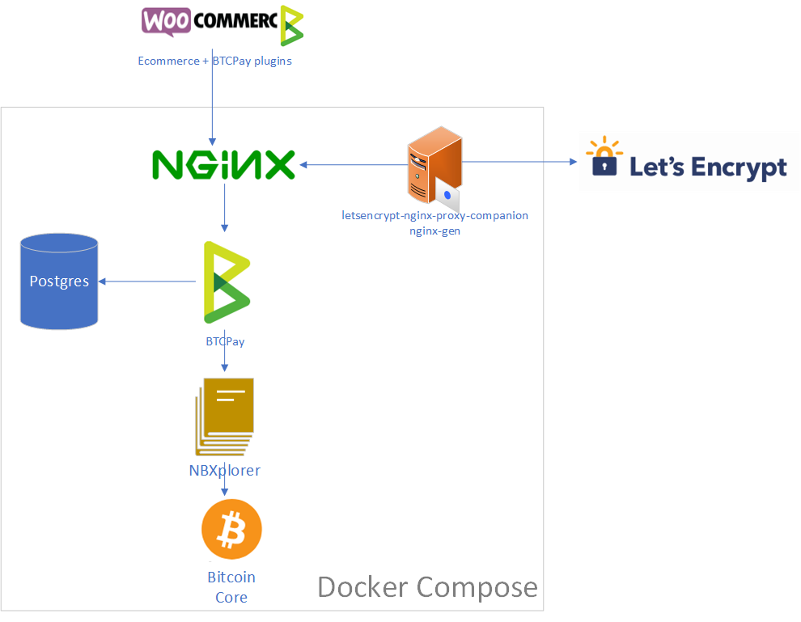

# About those docker-compose

All `docker-compose` files in [Production](Production) and [Production-NoReverseProxy](Production-NoReverseProxy) are generated by running the [build-pregen.sh](build-pregen.sh) (or [build-pregen.ps1](build-pregen.ps1)) script from the fragments located in [docker-compose-generator/docker-fragments](docker-compose-generator/docker-fragments).

The pre-generated `docker-compose` files only cover `btc`, `ltc`, `clightning` with `nginx`.

---

We strongly advise you to not use the pre-generated docker-compose of this folder, they are deprecated and kept only for backward compatibility.
Instead use the [build.sh](../build.sh) as documented in (README)(../Readme.md) to generate a docker-compose which fit your needs.

---

The `docker-compose` can be used for production purpose.

It is composed of:

1. One full node per supported cryptocurrency (bitcoind/litecoind)
2. A lightweight block explorer ([NBxplorer](https://github.com/dgarage/NBXplorer))
3. A [BTCPay Server](https://github.com/btcpayserver/btcpayserver)
4. A database (Postgres)
5. A reverse proxy (NGINX)
6. Two containers configuring NGINX as a reverse proxy and renewing SSL certificates.



[The Deploy on Azure Button](https://github.com/btcpayserver/btcpayserver-azure) is using this `docker-compose` under the hood on an Ubuntu machine. You can use it on any docker supporting host.

The relevant environment variables are:

* `NBITCOIN_NETWORK`: The blockchain identifier used by NBitcoin (eg., `regtest`, `testnet`, `mainnet`)
* `BTCPAY_HOST`: The external url used to access the NGINX server from internet. This domain name must point to this machine for Let's Encrypt to create your certificate. (typically with a CNAME or A record)
* `BTCPAY_ROOTPATH`: The root path directory where BTCPay is accessed, more information below. (default: /)
* `LETSENCRYPT_EMAIL`: The email Let's Encrypt will use to notify you about certificate expiration.
* `ACME_CA_URI`: Let's encrypt API endpoint (`https://acme-staging.api.letsencrypt.org/directory` for a staging certificate, `https://acme-v01.api.letsencrypt.org/directory` for a production one)
* `LIGHTNING_ALIAS`: Optional, if using the integrated lightning feature, customize the alias of your nodes

If `BTCPAY_HOST` is `btcpay.example.com` and `BTCPAY_ROOTPATH` is `/btcpay`, then you can access the site via `https://btcpay.example.com/btcpay`

Use `docker-compose.btc-ltc.yml` for bitcoin and litecoin support, or `docker-compose.btc.yml` for only bitcoin.

Any unset or empty environment variable will be set for a `regtest` deployment.

The ports mapped on the host are:

1. `80` for Let's encrypt
2. `443` for the website
3. `9735` for the bitcoin lightning network node (if used)
4. `9736` for the litecoin lightning network node (if used)

Example for running on `mainnet`:

For linux:

```
docker-compose up \
    -e "NBITCOIN_NETWORK=mainnet" \
    -e "BTCPAY_HOST=btcpay.example.com" \
    -e "LETSENCRYPT_EMAIL=me@example.com" \
    -e "ACME_CA_URI=https://acme-v01.api.letsencrypt.org/directory"
```

For powershell:

```
docker-compose up `
    -e "NBITCOIN_NETWORK=mainnet" `
    -e "BTCPAY_HOST=btcpay.example.com" `
    -e "LETSENCRYPT_EMAIL=me@example.com" `
    -e "ACME_CA_URI=https://acme-v01.api.letsencrypt.org/directory"
```

See also [The guide for docker noobs](../README.md#fornoobs).

Make sure the domain `btcpay.example.com` point to your server and that port `80` and `443` are open.