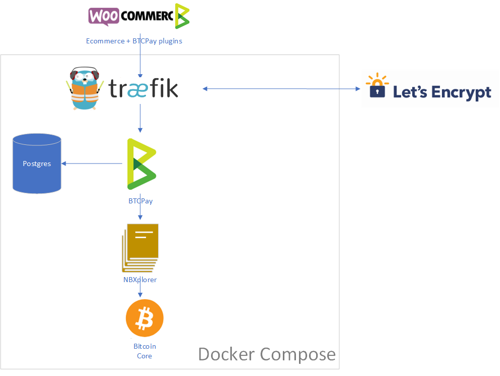

# How to use docker-compose with Traefik

Traefik is a modern reverse proxy aimed towards applications running through container orchestrators.

Some of the benefits of using Traefik over NGinx are:

- Real-time configuration changes - no need to reload the proxy
- Auto discovery and configuration of services through a vast amount of container orchestrators.
- Built-in official support for Let's Encrypt SSL with certificate auto-renewal
- Supports path-based routing without need to [hard-code it in global config](../Production/nginx.tmpl).

## Traefik Specific Environment Variables

- `BTCPAYGEN_REVERSEPROXY` to `traefik`.
- `LETSENCRYPT_EMAIL`: Optional, The email Let's Encrypt will use to notify you about certificate expiration.
- `BTCPAYGEN_ADDITIONAL_FRAGMENTS`: Add `traefik`
- `BTCPAY_ADDITIONAL_HOSTS`: Traefic can not accept list of hosts. Add additional hosts in a new file named e.g. `btcpayserver-traefic.custom.yml`:
  ```
  version: "3"
  services:
    btcpayserver:
      labels:
        traefik.http.routers.btcpayserver2.rule: Host(`additional.example.com`)
        traefik.http.routers.btcpayserver3.rule: Host(`another-additional.example.com`)
  ```


