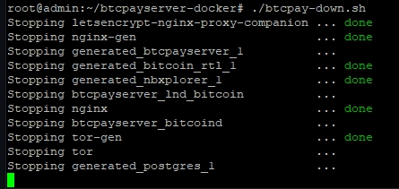

# Fast sync Bitcoin for BTCPay Server

## What problem does Fast Sync solve?

When you start a new BTCPay Server, you need to synchronize your Bitcoin node from the genesis block.

Validating from the genesis blocks takes, in general, 1 or 2 days on affordable servers. (around 10$ per month)

However, synchronization time will take around two weeks on some low-powered devices like a raspberry PI. (and it will linearly increase with time)

Fast Sync provides a solution to decrease the synchronization time dramatically to minutes or a few hours.

:::warning
Current UTXO Set snapshots only work for Bitcoin Core 0.17.0 or higher. Do NOT use these sets on older versions of Bitcoin Core (0.16.3 or lower)
:::

## How does Fast Sync solve the problem?

For Bitcoin software to operate, you do not need all the history of blocks from the genesis. 

You need the state of Bitcoin up to a certain block (this state is called `UTXO Set`), and around ~300 blocks before this point.

Fast Sync downloads the UTXO Set at a specific block on an external server, and deploy it on your node. We call this file a `UTXO Set snapshot`.

When your node starts up again, with the `UTXO Set snapshot` it will only need to synchronize from this point to the latest blocks.

## What are the downsides of Fast Sync?

### Malicious UTXO Set

Fast Sync can potentially get abused:
1. The attacker gives you a `UTXO Set snapshot`, which does not follow Bitcoin consensus.
2. The attacker makes a purchase to your store. 
3. Nodes following the consensus would not recognize the payment as valid, but your node will. 
4. The coins the attacker sent you are just worthless.

Other attacks can completely bring down your node.

### Lightning Network routing issues

As a merchant, you generally do not care about this issue. Merchants are mainly receiving payment, so they don't need to do any routing.

However, if you plan to send payments from your lightning node, you may have issues:

Because you do not have old blocks, your lightning node won't see any channels created prior to the snapshot.

If this is a problem for you, use an older snapshot.

## How to verify that the UTXO Set snapshot follows the consensus?

### If you trust the owner of this repository....

The snapshots recognized as valid by the `btcpayserver-docker` repository you've cloned, can be found on [utxo-sets](utxo-sets).

When you SSH into your new Sync BTCPay Server (by the use of Putty, for example), the first thing you have to do is become `root`. 

```bash
sudo -i
```

Before you start the [load-utxo-set.sh](load-utxo-set.sh), you must bring down your BTCPay Server. 

When in `~/btcpayserver-docker` you run `btcpay-down.sh` to bring down your instance.

```bash
cd btcpayserver-docker
./btcpay-down.sh
```

 

After you've shut down BTCPay Server, you now go into the `~/btcpayserver-docker/contrib/FastSync/` directory.

If you want to be sure you're in the correct directory, hit the `ls` command after the `cd contrib/FastSync`

```bash
cd contrib/FastSync
ls
```

The script [load-utxo-set.sh](load-utxo-set.sh) will download the utxo-set from the environment variable `UTXO_DOWNLOAD_LINK`.

If `UTXO_DOWNLOAD_LINK` is empty, `NBITCOIN_NETWORK` (with value set to `mainnet` or `testnet`) will be used to take a default `UTXO_DOWNLOAD_LINK` that we hard coded inside [load-utxo-set.sh](load-utxo-set.sh).

```bash
./load-utxo-set.sh
```


Once the files are downloaded, the hash will be checked against those in [utxo-sets](utxo-sets).


After the [load-utxo-set.sh](load-utxo-set.sh) is done, you will be warned, and asked to delete the docker volume `generated_bitcoin_wallet_datadir`.
This will be recreated when we now run the `btcpay-up.sh` script. 

```bash
docker volume rm generated_bitcoin_wallet_datadir
```

Now go back to `~/btcpayserver-docker` directory, and let's restart your Server with `./btcpay-up.sh` to sync the rest!

```bash
cd ../../
./btcpay-up.sh
```

The rest of the Sync will take place on your BTCPay Server until it reaches the latest block height. 

You can either follow this process in the UI of the BTCPay Server or run the following command in the CLI. This will show you the latest log output and the current block height of your `Fast Sync` node.  

```bash
docker logs --tail -100 btcpayserver_bitcoind
```


:::warning
**However: This will only prove that the owner of this git repository is honest, and the utxo-sets are verified and correct.**
**Completing those steps does not mean that the UTXO set snapshot is legit. It only means that you trust the owner of this git repository to have verified that it is legit.**
:::

### Don't trust, verify!<a name="donttrust"></a>

If you don't trust anybody, which should be the case as much as possible, then here are the steps to verify that the UTXO set you just loaded is not malicious.

1. You need another node that you own, entirely `under your control`, that `you synchronized from the genesis block`. Let's call this node `Trusty`.
2. In the previous [step](./README.md#if-you-trust-the-owner-of-this-repository) you've set up the `Fast Sync` node. Let's call this `Synchy`.
3. Wait for `Synchy` to be fully synced.
4. Now on, `Synchy` and `Trusty` run the following command at the same time:

If `Synchy` or `Trusty` are both using BTCPay Server, go to `~/btcpayserver-docker/` and use:

```bash
bitcoin-cli.sh gettxoutsetinfo
```

Or use if non BTCPay Server node :

```bash
 bitcoin-cli gettxoutsetinfo
```

Running this command might take some time, and nothing will show up in the terminal in the meantime. 

5. Verify that the output of `Synchy` and `Trusty` are identical (you can ignore `disk_size`).


:::warning
**Completing those steps, assuming the software you are running is not malicious, correctly prove that the UTXO set snapshot is legit**.
:::

### If you trust someone else...

This repository contains the signatures of some developers, for example [sigs/NicolasDorier.utxo-sets.asc](sigs/NicolasDorier.utxo-sets.asc) contains the hashes that `NicolasDorier` verified himself.

You need to verify with [KeyBase command line](https://keybase.io/docs/command_line) that the signature is legit:
```bash
keybase pgp verify -i sigs/NicolasDorier.utxo-sets.asc
```
If you don't like command line, you can verify against [keybase verify page](https://keybase.io/verify) by just copying and pasting the content of [sigs/NicolasDorier.utxo-sets.asc](sigs/NicolasDorier.utxo-sets.asc).

You can verify that the handle `NicolasDorier` refers to the person who controls `NicolasDorier` Twitter, GitHub, and Reddit handle on [the keybase profile page](https://keybase.io/NicolasDorier).

:::tip
**Completing those steps does not mean that the UTXO set snapshot is legit**. It only means that you trust the owner of a Keybase account, who has proved access to some social media accounts in the past.
:::

## FAQ
### Can I add my signature to this repository?

If you are a bitcoin developer or public figure, feel free to add your signature. For this, you need:

1. A [keybase account](http://keybase.io) linked to your social media accounts.
2. Follow the steps described in the [Don't trust, verify!](#donttrust) section for each snapshot you want to sign.
3. Create a file with the same format as [utxo-sets](utxo-sets) with the snapshots you validated. (Let's call this file `YOU.utxo-sets`)
4. Run the following command line

```bash
# Assuming you are inside the FastSync directory
keybase pgp sign -i YOU.utxo-sets -c -t -o sigs/YOU.utxo-sets.asc
rm YOU.utxo-sets
git add sigs/YOU.utxo-sets.asc
git commit -m "Add YOU utxo-set signature" --all
```
And make a pull request to `btcpayserver-docker` repository.

### Where can I download UTXO set snapshots

You should not need to do this because [load-utxo-set.sh](load-utxo-set.sh) will do the hard work for you. 

But if you want, browse on [this listing](http://utxosets.blob.core.windows.net/public?restype=container&comp=list&include=metadata). 

Select the snapshot you want, and download it by querying `http://utxosets.blob.core.windows.net/public/{blobName}`.

### How can I create my own snapshot?

Assuming you have a node running on a docker deployment of BTCPay Server, you need to run [save-utxo-set.sh](save-utxo-set.sh).

 This script shows the steps to create an archive of the current UTXO Set
 It will:
1. Shutdown BTCPay Server
2. Start bitcoind
3. Prune it to up to 289 blocks from the tip
4. Stop bitcoind
5. Archive in a tarball the blocks and chainstate directories
6. Restart BTCPay
7. If `AZURE_STORAGE_CONNECTION_STRING` is set, then upload to azure storage and make the blob public else print hash and tarball

### How can I do this for my altcoin?

Your altcoin does not need it. Almost nobody uses it compared to bitcoin.

However, if you insist follow what we did for Bitcoin, we can't handhold you on this.

### Do you plan to destroy Bitcoin?

This feature may be controversial because of the risk that almost nobody will follow the [Don't trust, verify!](#donttrust) step.

What if somebody starts spreading a corrupted snapshot on the wild scale?

I think this issue can be mitigated at the social layer. If several people start using social media to spread their `bitcoin-cli getutxosetinfo` every 10 000 blocks, any corrupt snapshot would be soon detected. We plan to make expose the hash via `BTCPayServer` and make it easy for people to share.

### Why you don't just: Make BTCPayServer rely on SPV

All SPV solution brings a systemic risk to Bitcoin. Suppose everybody relies on SPV to accept payment, and miners want to change consensus rules. In that case, you will have no leverage as an individual or a community to decide against.

Even with `UTXO Set snapshots`, you continue to validate consensus rules from the block of the snapshot.

### Why you don't just: Make BTCPayServer rely on an external trusted node

Why not just host BTCPayServer on the raspberry pi, but the full bitcoin node on another machine?

For two reasons:

First, `BTCPayServer` is trying to reduce the technical barriers to operating payments on your own. Running on an external node means that the user needs the technical skills to set it up.

`BTCPayServer` also relies on Bitcoin's RPC, which is not meant to be exposed on the internet. We can't see a simple enough solution that would allow normal people to run an external node elsewhere.

The second reason is reliability: You want your service to be self-contained. If you host a node on another server, and for some reason, this Server goes down, then your `BTCPayServer` hosted on the raspberry PI will also cease to function.
