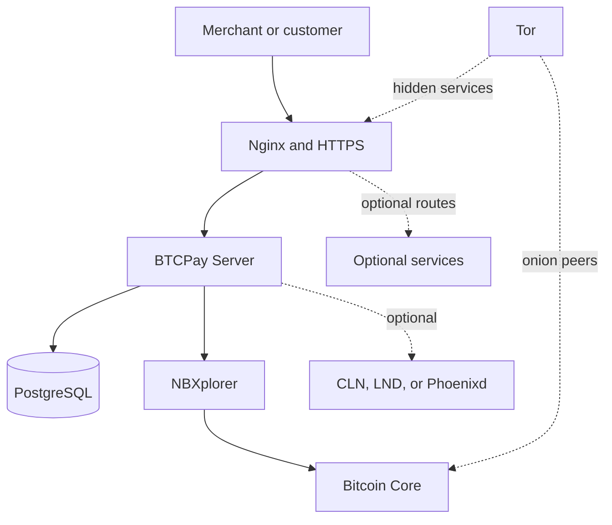

# Architecture

The generator assembles a Docker Compose stack from reusable fragments. The
selected cryptocurrencies, reverse proxy, Lightning implementation, and
optional fragments determine the final services.

## Core Components

- **BTCPay Server** provides the merchant interface, APIs, invoices, and
  application services.
- **PostgreSQL** stores BTCPay Server and plugin data.
- **NBXplorer** indexes wallet-relevant blockchain activity for BTCPay Server.
- **Bitcoin Core** validates the Bitcoin blockchain and transactions.
- **Nginx** routes public requests and works with the ACME companion to obtain
  HTTPS certificates.
- **Tor** provides hidden services and selected onion connectivity. It does not
  route every service connection through Tor and does not make the deployment
  anonymous against a targeted attacker.

## Generated Configuration

`build.sh` passes the selected generator variables into the Docker Compose
generator. The standard setup writes:

- `Generated/docker-compose.generated.yml`
- `Generated/manifest.json`, containing selected fragments, Nginx routes, and
  generated-secret declarations
- `Generated/pull-images.sh`
- `Generated/save-images.sh`

`generate-secrets.sh` creates missing files declared by the manifest under the
repository's ignored `secrets/` directory. Existing secret files are retained.

## Persistent Data

Services store persistent data in Docker volumes. The generated Compose file is
disposable configuration; the volumes, databases, and generated secrets are
the state that must be considered for backup and recovery.

See [Backup and Restore](./backup-restore.md) before moving a production server,
especially one with Lightning channels.

## Optional Components

The generator can add Lightning nodes, other cryptocurrency nodes, application
services, storage profiles, and network endpoints. Fragment metadata expresses
required, recommended, exclusive, and incompatible selections. See the
[fragment catalog](./fragments.md) for the available options.
