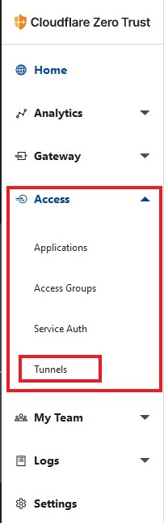
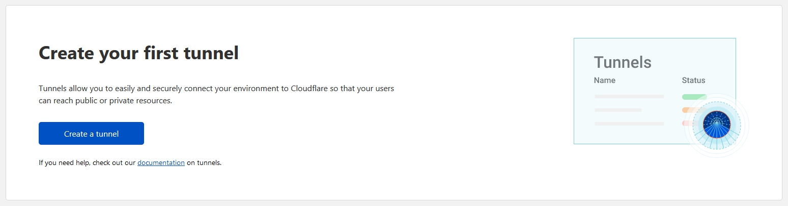
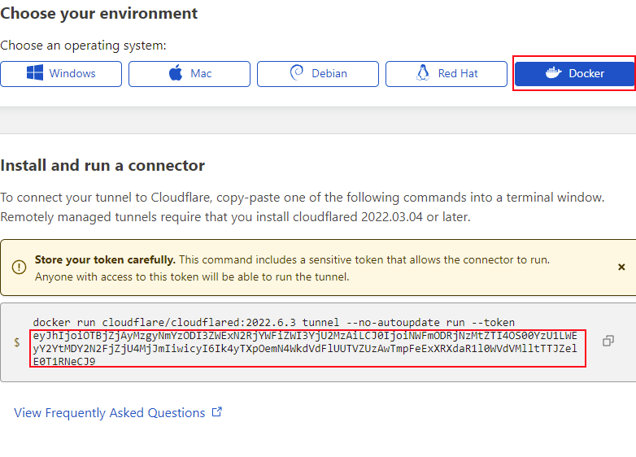
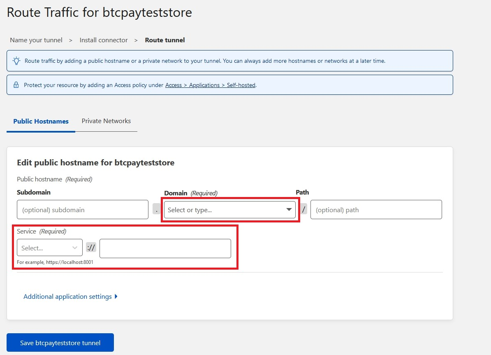
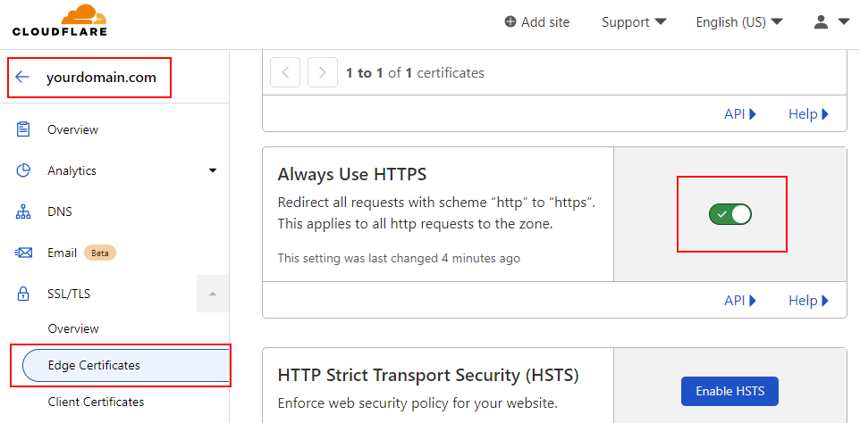

# Cloudflare tunnel support

Your server is on a local network, and you want to expose it on the internet (clearnet)?

While there are many solutions at your disposal, this one is by far the least costly and easiest.

Traditionally, the solution to this problem is either:
* Configure your firewall and your internet router (NAT) correctly to accept incoming traffic
* Use Tor
* Setup an SSH reverse tunnel to a public VPS

The challenge with the first solution is that there is no unified way to do it. Every local network has its own way of doing.
On top of it, it may not even work: internet server providers may block incoming traffic, or they might use dynamic IPs. You need to set up a [dyndns service](https://docs.btcpayserver.org/Deployment/DynamicDNS/) to update the DNS record when the IP changes automatically.

The challenges with the second solution are that Tor has very high latency, so your server will feel sluggish and unreliable, and you would need a Tor-enabled browser to access it. (such as Brave or Tor Browser)

The third solution is technically challenging and isn't free, as you need to pay for a VPS.

Cloudflare tunnel offers an alternative to those solutions with a single downside: Cloudflare can see or modify all of your traffic, as it acts as a middleman between the client's browser and your local server.

With Cloudflare tunnel, you will enjoy low latency access to your server, on clearnet, and WITHOUT the need to configure your firewall, internet router, dynamic DNS, and any internet service provider. For free.

You still need to configure the tunnel correctly; this documentation will guide you through it.

## How to use?

First, we are going to create the tunnel on Cloudflare.

1. You need to [create an account on Cloudflare](https://cloudflare.com/).
2. Enable Cloudflare for your domain name. For Namecheap, [follow this tutorial](https://www.namecheap.com/support/knowledgebase/article.aspx/9607/2210/how-to-set-up-dns-records-for-your-domain-in-cloudflare-account/).
3. After the DNS changes are propagated, go to [Zero Trust](https://dash.teams.cloudflare.com/) option on the left menu, go to `access`, then click `tunnels`.



4. Click the `create tunnel` button, and give it a name



5. In `Choose your environment`, click on docker and copy your token. You will need it later (the string after `--token`, as shown in the following screenshot)



6. Click on the `Next` button
7. Enter your subdomain, and select your domain in the list. Then in `Service` select `HTTP` and enter `nginx`.



8. In the SSH section of your server, add Cloudflare tunnel by running the following script. (replace `<YOUR_TOKEN_HERE>` with what you copied in step `5.`, and also replace `<YOUR_DOMAIN_HERE>` with the domain you entered in steps `7.`)
```bash
BTCPAY_HOST="<YOUR_DOMAIN_HERE>"
[[ "$REVERSEPROXY_DEFAULT_HOST" ]] && REVERSEPROXY_DEFAULT_HOST="$BTCPAY_HOST"
CLOUDFLARE_TUNNEL_TOKEN="<YOUR_TOKEN_HERE>"
BTCPAYGEN_ADDITIONAL_FRAGMENTS="$BTCPAYGEN_ADDITIONAL_FRAGMENTS;opt-add-cloudflared"
BTCPAYGEN_EXCLUDE_FRAGMENTS="$BTCPAYGEN_EXCLUDE_FRAGMENTS;nginx-https"
. btcpay-setup.sh -i
```

Now you should be able to access your server from the internet! (If you get an Nginx error 503, check below)

## Recommended additional step

In [cloudflare dashboard](https://dash.cloudflare.com), navigate to your websites, go to `Edge Certificates`, and check `Always Use HTTPS`. This will make sure that any request to your website uses HTTPS.


## Known error

### Error 503

An error 503 means that the tunnel is working and Cloudflare is correctly set up, the HTTP request is reaching your server, but the server's reverse proxy doesn't know which downstream container should receive the request.

This command will instruct you to forward any requests from your domain to your BTCPay Server container. It also instructs you to forward any HTTP requests with an unrecognized domain name to your BTCPay Server container.

```bash
BTCPAY_HOST="<YOUR_DOMAIN_HERE>"
REVERSEPROXY_DEFAULT_HOST="<YOUR_DOMAIN_HERE>"
. btcpay-setup.sh -i
```

`REVERSEPROXY_DEFAULT_HOST` will ensure you can still access your server from the local network with an IP or a local domain name.
