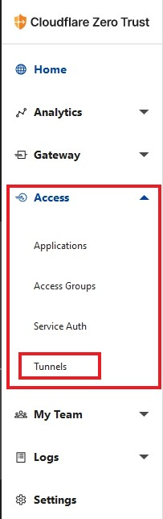
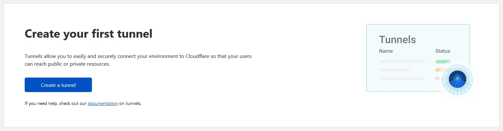
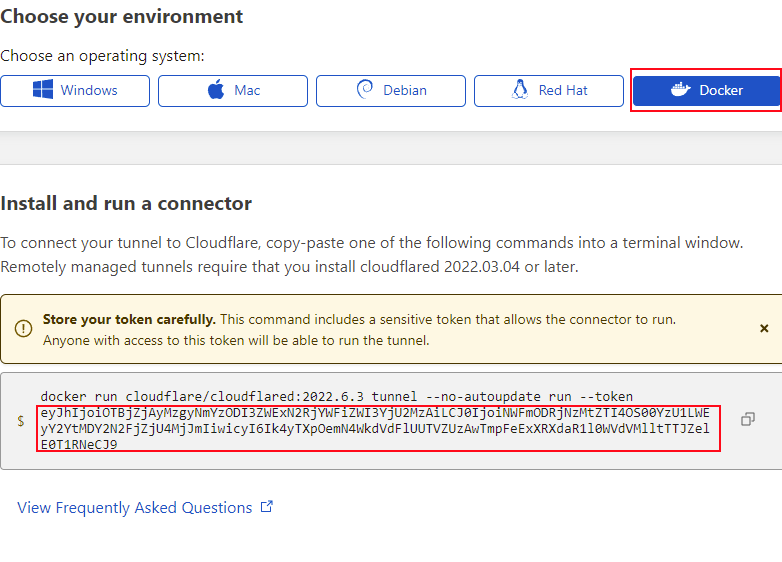
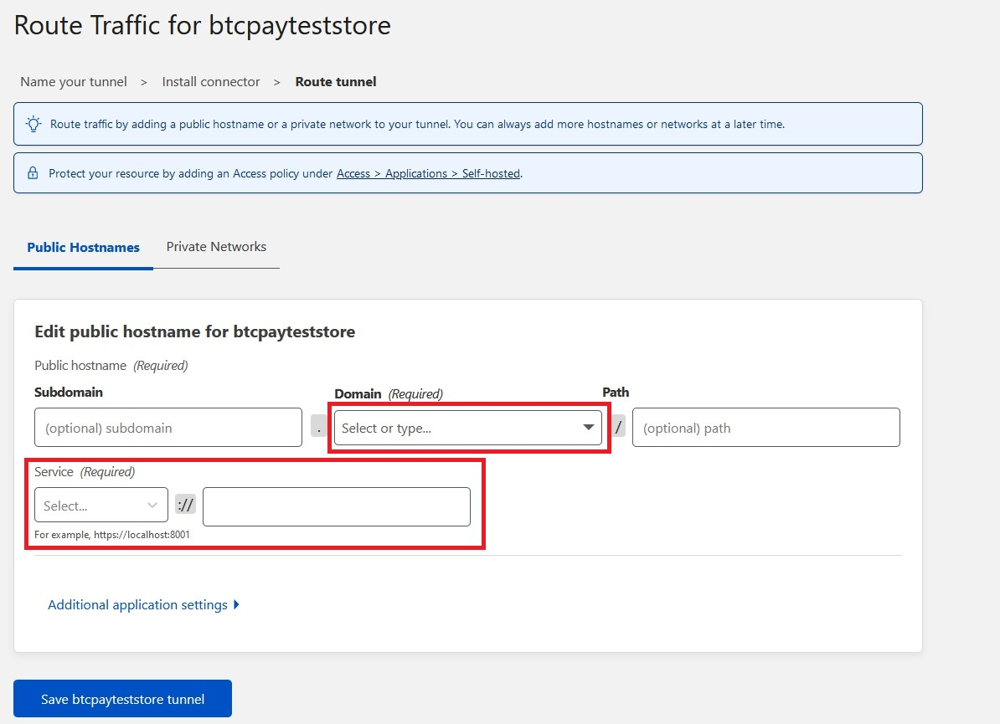
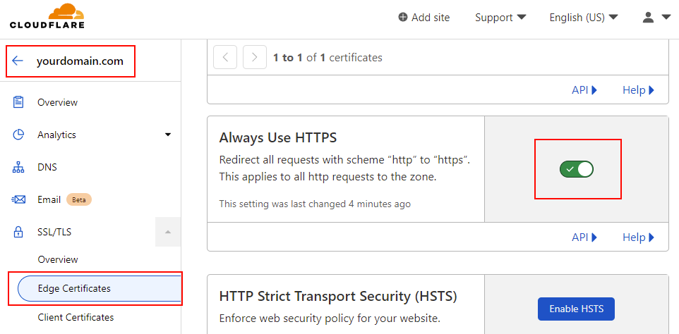

# Cloudflare Tunnel

Cloudflare Tunnel can expose a BTCPay Server running on a private network
without opening an inbound router port or maintaining dynamic DNS. Alternatives
include direct port forwarding, Tor, or a reverse tunnel through a public host.

This design adds Cloudflare as a trusted intermediary: Cloudflare terminates the
client connection and can observe or modify traffic. Availability also depends
on Cloudflare and on the server's outbound internet connection. Use Tor or a
different ingress design if that trust model is unsuitable.

## Prerequisites

This integration requires an existing BTCPay Server Docker deployment using the
bundled Nginx reverse proxy (`BTCPAYGEN_REVERSEPROXY=nginx`). Run fragment
changes from a root login shell. Your server must be able to make outbound
connections to Cloudflare on port 7844; no inbound tunnel port is required.

The tunnel token is a secret. Setup persists it in the deployment `.env` file,
and Docker configuration can expose it to users with Docker access. Keep host
and Docker access restricted, do not share command output containing the token,
and rotate the token in Cloudflare if it is disclosed.

## Configure the Tunnel

First, we are going to create the tunnel on Cloudflare.

1. You need to [create an account on Cloudflare](https://cloudflare.com/).
2. Enable Cloudflare for your domain name. For Namecheap, [follow this tutorial](https://www.namecheap.com/support/knowledgebase/article.aspx/9607/2210/how-to-set-up-dns-records-for-your-domain-in-cloudflare-account/).
3. After the DNS changes are propagated, open the [Cloudflare dashboard](https://dash.cloudflare.com/?to=/:account/tunnels), then go to **Networking > Tunnels**.



4. Click the `create tunnel` button, and give it a name



5. In `Choose your environment`, click on docker and copy your token. You will need it later (the string after `--token`, as shown in the following screenshot)



6. Click on the `Next` button
7. Add a **Published application** route. Enter your subdomain, select your
   domain, and set the service URL to `http://nginx`.



8. In a root login shell on the server, add Cloudflare Tunnel with the following
   commands. Replace `<YOUR_TOKEN_HERE>` with what you copied in step 5 and
   `<YOUR_DOMAIN_HERE>` with the domain you entered in step 7.

```bash
export BTCPAY_HOST="<YOUR_DOMAIN_HERE>"
export CLOUDFLARE_TUNNEL_TOKEN="<YOUR_TOKEN_HERE>"
btcpay-fragments add opt-add-cloudflared
```

The Cloudflare fragment disables Nginx's Let's Encrypt companion because
Cloudflare terminates HTTPS for the tunnel. It also trusts forwarded headers.
Block all direct access to the configured Nginx HTTP port, including access from
untrusted local networks, so requests can reach it only through the tunnel.
Otherwise, a client that bypasses Cloudflare can forge forwarded headers.

A published application is public by default. If access should be restricted,
configure a Cloudflare Access application and policy before relying on the
tunnel for access control.

Now you should be able to access your server from the internet. If you get an
Nginx error 503, check the troubleshooting section below.

## Recommended additional step

In the [Cloudflare dashboard](https://dash.cloudflare.com), navigate to your
website, go to **SSL/TLS > Edge Certificates**, and enable **Always Use HTTPS**.
This ensures that visitors use HTTPS.



## Troubleshooting

### Error 503

An error 503 generally means that the tunnel reached Nginx but Nginx could not
select the expected downstream service. Confirm that the published application
uses `http://nginx`, that its hostname exactly matches `BTCPAY_HOST`, and that
the BTCPay containers are running. Do not work around this by setting a default
host for unrecognized requests or by opening direct access to Nginx; doing so
weakens the tunnel's forwarded-header trust boundary.
